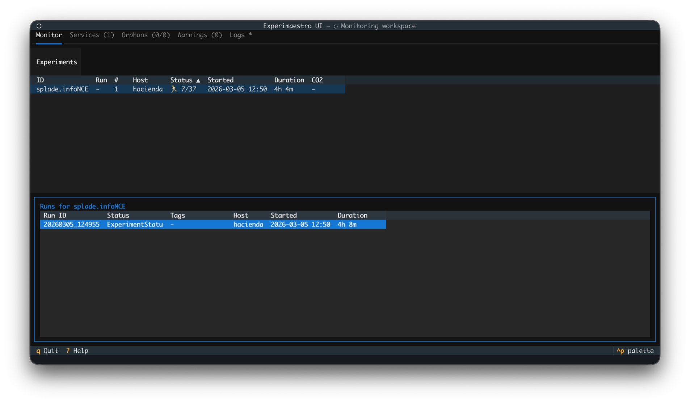
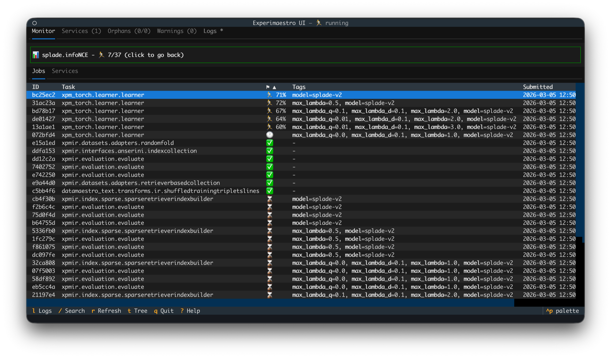
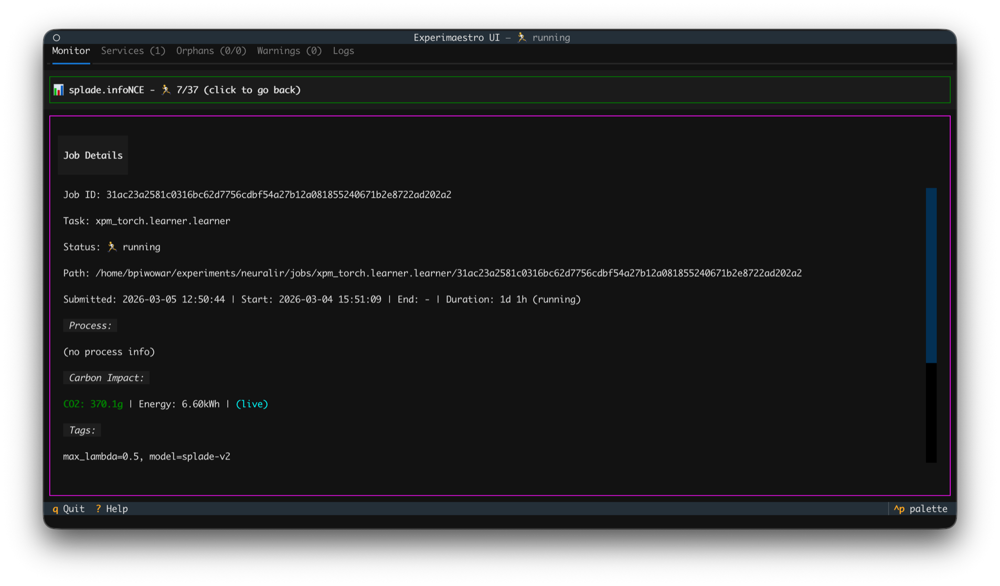
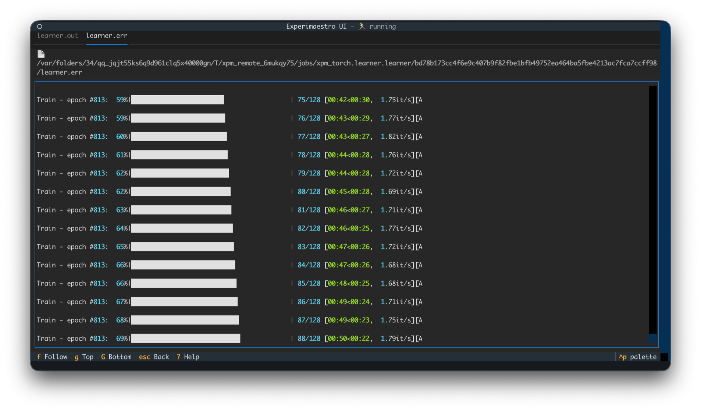
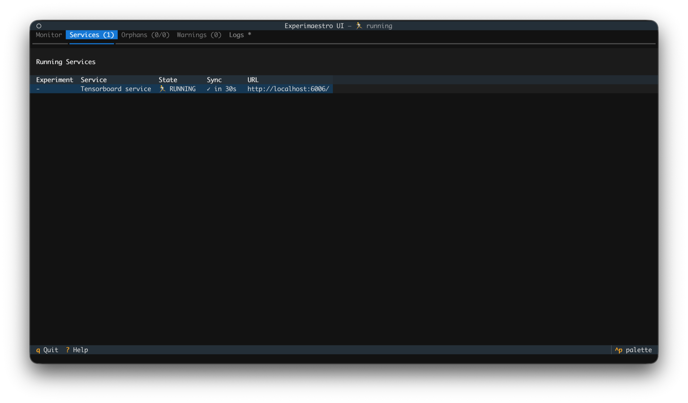

[](https://badge.fury.io/py/experimaestro)
[](https://experimaestro-python.readthedocs.io)


**Experimaestro** is a Python framework designed for researchers and engineers who need to manage complex, large-scale experimental workflows without losing track of reproducibility.

Unlike traditional schedulers, Experimaestro focuses on the **experimental logic**: how configurations relate to each other and how results are organized.

## Why Experimaestro?

- **🚀 Configuration-as-Code:** Define your experiments using strongly-typed Python objects. Forget about fragile JSON/YAML files; benefit from IDE autocompletion, type checking, and recursive parameter management.
- **🛡️ Deduplication & Reproducibility:** Every task is assigned a unique identifier based on its parameters. If you try to run the same experiment twice, Experimaestro knows—ensuring you never waste compute time on results you already have.
- **📁 Organized by Design:** Results are automatically cached in a predictable directory structure derived from task identifiers. No more "results_v2_final_fixed.pt"—your file system stays as clean as your code.
- **🏗️ Built-in Scalability:** Seamlessly transition from local testing to high-performance clusters. Use **Connectors** (Local, SSH) and **Launchers** (Direct, Slurm) to run the same experimental code across different environments.

## Documentation

The full documentation is at [experimaestro-python.readthedocs.io](https://experimaestro-python.readthedocs.io):

- [Tutorial](https://experimaestro-python.readthedocs.io/en/latest/tutorial.html) — set up your first workspace and run a basic experiment (training a CNN on MNIST).
- [Configurations](https://experimaestro-python.readthedocs.io/en/latest/experiments/config.html) & [Tasks](https://experimaestro-python.readthedocs.io/en/latest/experiments/task.html) — define parameters, dependencies and execution logic.
- [Launchers](https://experimaestro-python.readthedocs.io/en/latest/launchers/index.html) & [Connectors](https://experimaestro-python.readthedocs.io/en/latest/connectors/index.html) — control where and how your code runs.
- [How it differs](https://experimaestro-python.readthedocs.io/en/latest/index.html#difference-with-other-projects) from Slurm, OAR, Comet, Sacred and other experiment managers.

# Screenshots

## Textual interface (new in v2)

<figure>
  
  <figcaption>Experiments overview: monitor (local or SSH) running and completed experiments</figcaption>
</figure>

<figure>
  
  <figcaption>Jobs view: track job status, progress, and dependencies</figcaption>
</figure>

<figure>
  
  <figcaption>Job details: inspect individual job parameters and output</figcaption>
</figure>

<figure>
  
  <figcaption>Logs view: real-time log streaming for running tasks</figcaption>
</figure>

<figure>
  
  <figcaption>Services view: monitor background services and their status</figcaption>
</figure>

# Install

## With pip

You can then install the package using `pip install experimaestro`

## Develop

Checkout the git directory, then

```
pip install -e .
```

# Coding assistant skill

Experimaestro ships an [agent skill](https://www.anthropic.com/news/skills) that
teaches LLM coding assistants (Claude Code, Cursor, …) the framework's
conventions and best practices. Install it with:

```bash
# Default: ~/.agents/skills/ (cross-client open standard)
experimaestro install-skill

# Install for a specific tool
experimaestro install-skill claude     # ~/.claude/skills/
experimaestro install-skill cursor     # ~/.cursor/skills/

# Install to several targets at once
experimaestro install-skill agents claude

# List available targets and what is already installed
experimaestro install-skill --list
```

# Example

This very simple example shows how to submit two tasks that concatenate two strings.
Under the curtain,

- A directory is created for each task (in `workdir/jobs/helloworld.add/HASHID`)
  based on a unique ID computed from the parameters
- Two processes for `Say` are launched (there are no dependencies, so they will be run in parallel)
- A tag `y` is created for the main task

<!-- SNIPPET: MAIN ARGS[%WORKDIR% --port 0 --sleeptime=0.0001] -->

```python
# --- Task and types definitions

import logging
logging.basicConfig(level=logging.DEBUG)
from pathlib import Path
from experimaestro import Task, Param, experiment, progress
import click
import time
import os
from typing import List

# --- Just to be able to monitor the tasks

def slowdown(sleeptime: int, N: int):
    logging.info("Sleeping %ds after each step", sleeptime)
    for i in range(N):
        time.sleep(sleeptime)
        progress((i+1)/N)


# --- Define the tasks

class Say(Task):
    word: Param[str]
    sleeptime: Param[float]

    def execute(self):
        slowdown(self.sleeptime, len(self.word))
        print(self.word.upper(),)

class Concat(Task):
    strings: Param[List[Say]]
    sleeptime: Param[float]

    def execute(self):
        says = []
        slowdown(self.sleeptime, len(self.strings))
        for string in self.strings:
            with open(string.__xpm_stdout__) as fp:
                says.append(fp.read().strip())
        print(" ".join(says))


# --- Defines the experiment

@click.option("--port", type=int, default=12345, help="Port for monitoring")
@click.option("--sleeptime", type=float, default=2, help="Sleep time")
@click.argument("workdir", type=Path)
@click.command()
def cli(port, workdir, sleeptime):
    """Runs an experiment"""
    # Sets the working directory and the name of the xp
    with experiment(workdir, "helloworld", port=port) as xp:
        # Submit the tasks
        hello = Say.C(word="hello", sleeptime=sleeptime).submit()
        world = Say.C(word="world", sleeptime=sleeptime).submit()

        # Concat will depend on the two first tasks
        Concat.C(strings=[hello, world], sleeptime=sleeptime).tag("y", 1).submit()


if __name__ == "__main__":
    cli()
```

which can be launched with `python test.py /tmp/helloworld-workdir`
