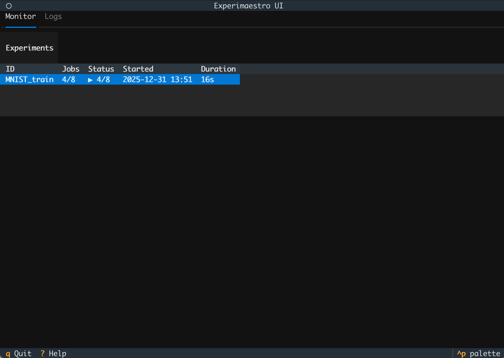
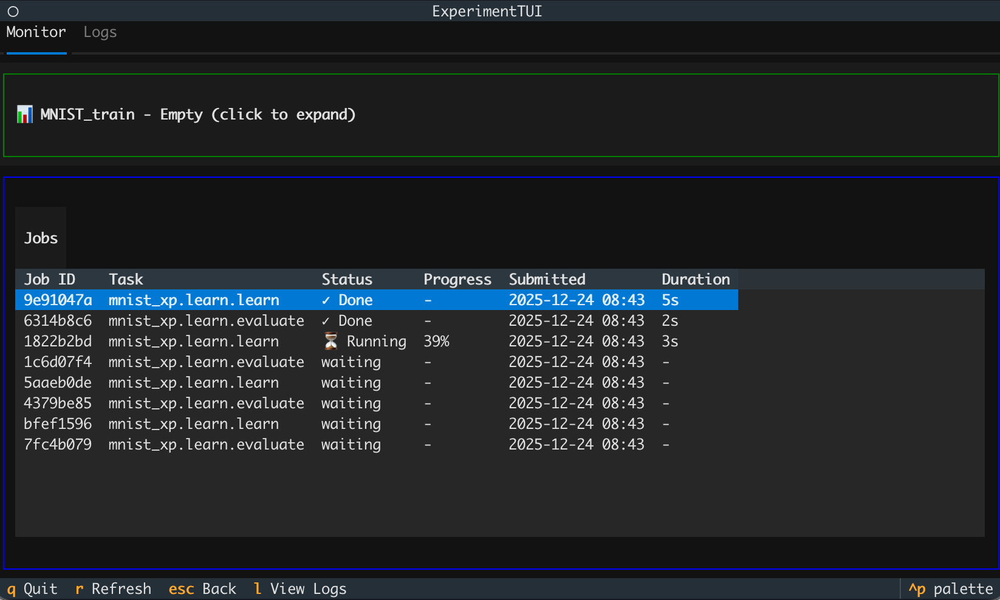
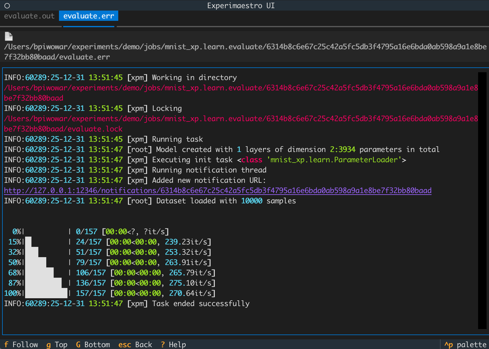

# Changelog

## Version 2.0 (2025)

Version 2.0 is a major release with significant new features, improved developer experience, and important breaking changes.

### New Features

#### Terminal UI (TUI)

A new interactive terminal interface built with [Textual](https://textual.textualize.io/) for monitoring experiments:

- Real-time experiment and job monitoring
- Push notifications via file watching
- SQLite persistence for tracking multiple experiments
- Thread-safe updates







Launch with:
```bash
experimaestro experiments monitor --console --workdir /path/to/workdir
```

#### [Resumable Tasks](experiments/task.md#resumable-tasks)

Tasks can now handle timeouts gracefully and resume from where they left off:

```python
from experimaestro import ResumableTask, GracefulTimeout, Meta, PathGenerator, field

class LongTraining(ResumableTask):
    epochs: Param[int] = 1000
    checkpoint: Meta[Path] = field(default_factory=PathGenerator("checkpoint.pth"))

    def execute(self):
        start_epoch = load_checkpoint(self.checkpoint) if self.checkpoint.exists() else 0

        for epoch in range(start_epoch, self.epochs):
            remaining = self.remaining_time()  # Query remaining walltime (SLURM)
            if remaining is not None and remaining < 300:
                save_checkpoint(self.checkpoint, epoch)
                raise GracefulTimeout("Not enough time for another epoch")

            train_one_epoch()
            save_checkpoint(self.checkpoint, epoch)
```

- `remaining_time()` method to query remaining walltime
- `GracefulTimeout` exception for clean timeout handling
- Configurable `max_retries` (default: 3) for automatic retry on timeout
- Log file rotation when resuming tasks

#### [Dynamic Task Outputs](experiments/task.md#dynamic-task-outputs)

Tasks can now produce outputs during execution with callback support:

```python
class Learn(ResumableTask):
    validation: Param[Validation]

    def execute(self):
        for step in range(100):
            train_step()
            if step % 10 == 0:
                self.validation.compute(step)  # Triggers callbacks

# Watch for outputs
learn.watch_output(validation.checkpoint, on_checkpoint)
learn.submit()
```

Callbacks are replayed when tasks restart, ensuring no outputs are missed.

#### Mypy Plugin

Full mypy support for experimaestro's `Config.C` pattern:

```toml
# pyproject.toml
[tool.mypy]
plugins = ["experimaestro.mypy"]
```

Provides:

- Type inference for `Config.C`, `XPMConfig`, `XPMValue`
- Proper `__init__` signatures with `Param` and `Meta` fields
- `submit()` return type inference (including `task_outputs`)
- `ConfigMixin` methods available on all Config subclasses

#### [Subparameters (Partial Identifiers)](experiments/config.md#subparameters-and-partial-identifiers)

Share directories across tasks that differ only in excluded parameters. This is particularly useful for:

- **Checkpoint sharing**: Training runs with different iteration counts can share the same checkpoint directory, enabling seamless resume from any previous run
- **Resource efficiency**: Avoid duplicating large files (model weights, preprocessed data) across similar experiments
- **Hyperparameter sweeps**: When varying certain parameters (e.g., number of epochs), other outputs remain shared

```python
class Learn(Task):
    checkpoints = subparameters(exclude_groups=["iter"])

    max_iter: Param[int] = field(group="iter")
    learning_rate: Param[float]

    checkpoints_path: Meta[Path] = field(
        default_factory=PathGenerator(),
        partial=checkpoints
    )
```

[Read more about subparameters...](experiments/config.md#subparameters-and-partial-identifiers)

#### [Configuration Composition](experiments/config.md#composition-operator)

Compose configurations using the `@` operator. The operator automatically finds the parameter in the outer configuration that accepts the inner configuration's type:

```python
class Encoder(Config):
    hidden_size: Param[int]

class Model(Config):
    encoder: Param[Encoder]

# These two are equivalent:
model1 = Model.C(encoder=Encoder.C(hidden_size=256))
model2 = Model.C() @ Encoder.C(hidden_size=256)
```

[Read more about configuration composition...](experiments/config.md#composition-operator)

#### [Flexible Deprecation](experiments/config.md#deprecating-a-configuration-or-attributes)

Deprecate and redirect configurations with automatic migration:

```python
@deprecate(NewConfig, replace=True)
class OldConfig(Config):
    ...
```

#### [Instance-Based Identity](experiments/config.md#instance-based-configurations)

Distinguish between *shared* and *separate* instances with identical parameters using `InstanceConfig`. Essential for workflows where components can be tied or independent:

```python
class Encoder(InstanceConfig):
    hidden_size: Param[int]

class DualEncoderModel(Config):
    query_encoder: Param[Encoder]
    doc_encoder: Param[Encoder]

enc = Encoder.C(hidden_size=128)
shared = DualEncoderModel.C(query_encoder=enc, doc_encoder=enc)      # tied weights
separate = DualEncoderModel.C(query_encoder=enc, doc_encoder=Encoder.C(hidden_size=128))  # independent
# shared and separate have different identifiers
```

Backwards-compatible: first instance keeps its original identifier.

#### [Workspace Auto-Selection](settings.md)

Workspaces can be automatically selected based on experiment ID patterns:

```yaml
# ~/.config/experimaestro/settings.yaml
workspaces:
  - id: neuralir
    path: ~/experiments/xpmir
    triggers:
      - "neuralir-*"
      - "ir-experiment"
```

#### Improved Stability

The scheduler has been refactored to use asyncio instead of threads for job management,
resulting in more predictable behavior and reduced race conditions.

#### Other Features

- **Environment tracking**: Git state and environment info saved for reproducibility
- **Conflict warnings**: Warns on conflicting tag values with source location tracking
- **Override warnings**: Warns when overriding arguments without `overrides=True` flag
- **[`value_class` decorator](experiments/config.md#value-classes)**: Register external types as experimaestro values
- **[Explicit default behavior](experiments/config.md#parameters)**: `field(ignore_default=...)` and `field(default=...)`

### Breaking Changes

#### Removed Deprecated Decorators

The following decorators, deprecated since v1.x, have been removed in v2:

- `@config`, `@task`, `@param`, `@option`, `@pathoption`

Use modern class-based syntax instead:

```python
class MyTask(Task):
    x: Param[int]
```

#### Init Tasks Affect Identifiers

Init tasks are now properly included in identifier computation. This may cause identifier changes for tasks that use `init_tasks`.

#### Default Values Require `field()`

Bare default values are deprecated:

```python
# Deprecated (warning)
class MyConfig(Config):
    x: Param[int] = 23

# Correct
class MyConfig(Config):
    x: Param[int] = field(ignore_default=23)  # Ignored in identifier if value==23
    # or
    x: Param[int] = field(default=23)  # Always included in identifier
```

Run `experimaestro refactor default-values` to automatically fix bare defaults.

#### Tags Are Now Experiment-Specific

Tags are now scoped to individual experiments rather than being global. This means tags set in one experiment are no longer visible in other experiments. Additionally, tags are no longer stored in the `params.json` file.

#### Workspace Database Migration

v2 uses a new workspace-level SQLite database format (stored in
`.experimaestro`). This SQLite is automatically synced based on the actual disk
state.

For detailed commit-level changes, see the [GitHub releases](https://github.com/experimaestro/experimaestro-python/releases).
