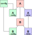

# Configurations

The most important concept in Experimaestro is that of a configuration. In Experimaestro, a configuration object is a fundamental concept used to specify parameters and settings for tasks and experiments. It acts as a structured way to input the necessary details to execute a task or a series of tasks. Here's a general description of what a configuration object in Experimaestro might encompass:

1. **Parameter Definition**: The configuration object defines the parameters needed for a task or experiment. These parameters can include data file paths, numerical values, strings, and other types of inputs that are essential for the execution of the task.

2. **Parameter Types and Validation**: Each parameter in the configuration object can have a specific type, such as integer, float, string, or more complex data types. The configuration object can include validation rules to ensure that the parameters provided are in the correct format and within expected ranges.

3. **Default Values**: For some parameters, the configuration object can specify default values. This is useful in cases where a parameter is optional or where a common default value is typically used.

4. **Documentation**: The configuration object can include documentation for each parameter, explaining its purpose and how it should be used. This documentation is crucial for making the configuration user-friendly, especially in complex experiments.

5. **Hierarchy and Nesting**: In complex tasks, the configuration object can be hierarchical or nested. This means that a configuration object can contain other configuration objects, allowing for the organization of parameters in a structured manner.

6. **Linking to Tasks**: The configuration object is typically linked to specific tasks or experiments. When a task is executed, it retrieves the necessary parameters from the associated configuration object.

7. **Flexibility and Extensibility**: Configuration objects are designed to be flexible and extensible, allowing users to add new parameters or modify existing ones as the requirements of the task evolve.

8. **Serialization**: Configuration objects are often serializable, meaning they can be saved to a file and loaded back. This is important for reproducibility and for sharing configurations between users or for future use.

In practical use, a configuration object acts as a bridge between the user (or another system) and the execution environment, ensuring that all the necessary inputs are provided and validated before the task is run. This structured approach aids in automating and scaling experiments, as well as in ensuring their reproducibility.


## Configuration identifiers

A configuration identifier in the context of systems like Experimaestro is a
unique identifier associated with a specific configuration object.
This identifier plays a crucial role in managing and referencing configurations,
especially in complex systems where multiple configurations are used. Here's a
detailed description:

1. **Uniqueness**: A configuration identifier is unique for each configuration
   instance. This uniqueness ensures that each configuration can be distinctly
   identified and referenced, avoiding confusion or overlap with other
   configurations.

1. **MD5 Hashes**: Experimaestro utilizes MD5 hashes as configuration
    identifiers. These hashes are unique to each configuration, ensuring a
    distinct and consistent identifier for every set of parameters.

1. **Run-Once Guarantee**: The unique MD5 hash identifiers ensure that each task
   associated with a specific configuration is executed only once. This is
   particularly important in avoiding redundant computations and ensuring the
   efficiency of the workflow.

**How is the identifier computed?**

The principale is the following. Any value can be associated with a unique byte
string: the byte string is obtained by outputting the type of the value (e.g.
string, ir.adhoc.dataset) and the value itself as a binary string. A special
handling of configurations and tasks (objects) is performed by sorting keys in
ascending lexicographic order, thus ensuring the uniqueness of the
representation.

 Moreover

- Default values are removed (e.g. k1 when set to 0.9). This allows to
  handle the situation where one adds a new experimental parameter
  (e.g. a new loss component). In that case, using a default parameter
  allows to add this parameter without invalidating all the previously
  ran experiments.
- Ignored values are removed (e.g. the number of threads when
  indexing, the path where the index is stored)


## Defining a configuration

A configuration is defined whenever an object derives from `Config`.

When an identifier is not given, it is computed as `__module__.__qualname__`. In that case,
it is possible to shorten the definition using the `Config` class as a base class.

!!! example

    ```py3
    from experimaestro import Param, Config

    class MyModel(Config):
        __xpmid__ = "my.model"

        gamma: Param[float]
    ```

defines a configuration with name `my.model` and one argument `gamma` that has the type `float`.

`__xpmid__` can also be a class method to generate dynamic ids for all descendant configurations
When `__xpmid__` is missing, the qualified name is used.

## Instance-based configurations

By default, two `Config` instances with identical parameters will have the same identifier. This is the desired behavior in most cases, as it ensures task deduplication and caching. However, in some scenarios, you need to distinguish between different instances even when their parameters are identical.

This is where `InstanceConfig` comes in. When a class derives from `InstanceConfig` instead of `Config`, each instance will have a unique identifier based on the order it appears during identifier computation.

### When to use InstanceConfig

Use `InstanceConfig` when:

- **Shared vs. Separate Resources**: You need to distinguish between shared and separate instances of the same configuration (e.g., shared model weights vs. separate model instances)
- **Multiple Identical Configurations**: The same configuration appears multiple times in a workflow, and each occurrence should be treated as distinct

!!! example "Shared vs Separate Model Instances"

    ```python
    from experimaestro import Param, Config, InstanceConfig

    class SubModel(InstanceConfig):  # Use InstanceConfig instead of Config
        """A model component that can be shared or separate"""
        hidden_size: Param[int] = 128

    class Ensemble(Config):
        """An ensemble using multiple models"""
        model1: Param[SubModel]
        model2: Param[SubModel]

    # Create two instances with identical parameters
    sm1 = SubModel.C(hidden_size=128)
    sm2 = SubModel.C(hidden_size=128)

    # Shared instance: both parameters point to the same instance
    shared = Ensemble.C(model1=sm1, model2=sm1)

    # Separate instances: each parameter has its own instance
    separate = Ensemble.C(model1=sm1, model2=sm2)

    # These will have DIFFERENT identifiers
    assert shared.__identifier__() != separate.__identifier__()
    ```

### Backwards compatibility

`InstanceConfig` is designed to be backwards compatible with existing experiments. The first occurrence of an `InstanceConfig` instance (with a given set of parameters) will have the same identifier as a regular `Config` would have. Only when a second instance with identical parameters is encountered does the instance order marker get added to the identifier.

This means you can migrate existing configurations to `InstanceConfig` without invalidating previous experiments, as long as you were only using a single instance of each configuration.

!!! warning

    Be careful when migrating to `InstanceConfig` if your workflow previously created multiple instances with the same parameters. The identifiers will change for the second and subsequent instances.

### How it works

During identifier computation, Experimaestro tracks `InstanceConfig` instances by their base identifier (computed from parameters). When the same base identifier is encountered multiple times (but with different Python object instances), each occurrence after the first gets a unique instance order marker added to its identifier.

The instance order is deterministic and based on the traversal order during identifier computation, ensuring reproducibility across runs.

## Object hierarchy

When deriving `B` from `Config`, experimaestro creates a **configuration
object** `A.XPMConfig` from `ConfigMixin` and `A`. When calling the
configuration constructor `A.C(...)` or (`B.C(...)`), the returned object is of
type `A.XPMConfig` or `B.XPMConfig`, which extends the original object with a
configuration specific behavior.




## Deprecating a configuration or attributes

When a configuration is moved (or equivalently its `__xpmid__` changed), its signature
changes, and thus the same tasks can be run twice. To avoid this, use the `@deprecate`
annotation.

!!! example

    ```py3
    from experimaestro import Param, Config, deprecate

    class NewConfiguration(Config):
        pass

    @deprecate
    class OldConfiguration(NewConfiguration):
        # Only pass is allowed here
        pass
    ```

It is possible to deprecate a parameter or option:

!!! example

    ```py3
    from experimaestro import Param, Config, deprecate

    class Learning(Config):
        losses: Param[List[Loss]] = []

        @deprecate
        def loss(self, value):
            # Checking that the new param is not used
            assert len(self.losses) == 0
            # We allow several losses to be defined now
            self.losses.append(value)

    ```

**Warning** the signature will change when deprecating attributes


To fix the identifiers, one can use the `deprecated` command. This
will create symbolic links so that old jobs are preserved and
re-used.

```sh
experimaestro deprecated list WORKDIR
```


## Object life cycle

### Initialisation

During [task](./task.md) execution, the objects are constructed following
these steps:

- The object is constructed using `self.__init__()`
- The attributes are set (e.g. `gamma` in the example above)
- `self.__post_init__()` is called (if the method exists)
- Pre-tasks are ran (if any, see below)

Sometimes, it is necessary to postpone a part of the initialization of a configuration
object because it depends on an external processing. In this case, the `initializer` decorator can
be used:

```py3
from experimaestro import Config, initializer

class MyConfig(Config):
    # The decorator ensures the initializer can only be called once
    @initializer
    def initialize(self, ...):
        # Do whatever is needed
        pass

```

## Types

Possible types are:

- basic Python types (`str`, `int`, `float`, `bool`) and paths `pathlib.Path`
- lists, using `typing.List[T]`
- enumerations, using `Enum` from the `enum` package
- dictionaries (support for basic types in keys only) with `typing.Dict[U, V]`
- Other configurations

## Parameters

```py3
class MyConfig(Config):
    """My configuration

    Long description of the configuration.

    Attributes:
        x: The parameter x
        y: The parameter y
    """
    # With default value
    # (warning: changing the default value CAN change the identifier)
    x: Param[type] = value

    # Alternative syntax, useful to avoid class properties
    x: Annotated[type, default(value)]

    # Without default value
    y: Param[type]

    # Using a docstring
    z: Param[int]
    """Most important parameter of the model"""
```

- `name` defines the name of the argument, which can be retrieved by the instance `self` (class) or passed as an argument (function)
- `type` is the type of the argument (more details below)
- `value` default value of the argument (if any). _If the value equals to the default, the argument will not be included in the signature computation_. This allows to add new parameters without changing the signature of past experiments (if the configuration is equivalent with the default value of course, otherwise do not use a default value!).

### Default Values

!!! warning

    When changing a default value, the identifier of configurations
    **might** change. The reason is explained below.

Adding a new parameter to a `Config` with a default value will not change the original `id`.

**Why?** The motivation is that with this behavior, you can add experimental parameters
that were previously hard-coded.

For instance, if the original class is:

```python
class MyConfig(Config):
    a: Param[int]

obj = MyConfig.C(a = 2)
id_old = obj.__identifier__()
```

Then when using the default value for parameter b will yield an object with the
same identifier.
```python
class myConfig(Config):
    a: Param[int]
    b: Param[int] = 4


# When not setting `b`, the identifier
# is the same
obj = myConfig.C(a = 2)
new_id = obj.__identifier__()
assert new_id == old_id

# When setting `b` to the default value,
# the same
obj = myConfig.C(a = 2, b = 4)
new_id = obj.__identifier__()
assert new_id == old_id
```

!!! warning

    The identifier can be different if only the default value is changed. In particular,
    if the default value is 2 (and not 4)

    ```python
    class myConfig(Config):
        a: Param[int]
        b: Param[int] = 2

    # Here, `b` is not the default value
    obj = myConfig.C(a = 4, b = 4)
    new_id = obj.__identifier__()
    assert new_id != old_id
    ```


### Constants

Constants are special parameters that cannot be modified. They are useful to note that the
behavior of a configuration/task has changed, and thus that the signature should not be the
same (as the result of the processing will differ).

```py3
from experimaestro import Constant
class MyConfig(Config):
    # Constant
    version: Constant[str] = "2.1"
```

### Metadata

Metadata are parameters which are ignored during the signature computation. For instance, the human readable name of a model would be a metadata. They are declared as parameters, but using the `Meta` type hint

```py3
class MyConfig(Config):
    """
    Attributes:
        count: The number of documents in the collection
    """
    count: Meta[type]
```

It is also possible to dynamically change the type of an argument using the `setmeta` method:

```py3
from experimaestro import setmeta

# Forces the parameter to be a meta-parameter
a = setmeta(A(), True)

# Forces the parameter to be a meta-parameter
a = setmeta(A(), False)

```

### Path option

It is possible to define special options that will be set
to paths relative to the task directory. For instance,

```py3
class MyConfig(Config):
    output: Annotated[Path, pathgenerator("output.txt")]
```

defines the instance variable `path` as a path `.../output.txt` within
the task directory. To ensure there are no conflicts, paths
are defined by following the config/task path, i.e. if the executed
task has a parameter `model`, `model` has a parameter `optimization`,
and optimization a path parameter `loss.txt`, then the file will be
`./out/model/optimization/loss.txt`.

## Validation

If a configuration has a `__validate__` method, it is called to validate
the values before a task is submitted. This allows to fail fast when parameters
are not valid.

```py3
class ModelLearn(Config):
    batch_size: Param[int] = 100
    micro_batch_size: Param[int] = 100
    parameters: Annotated[Path, pathgenerator("parameters.pth")]

    def __validate__(self):
        assert self.batch_size % self.micro_batch_size == 0
```
