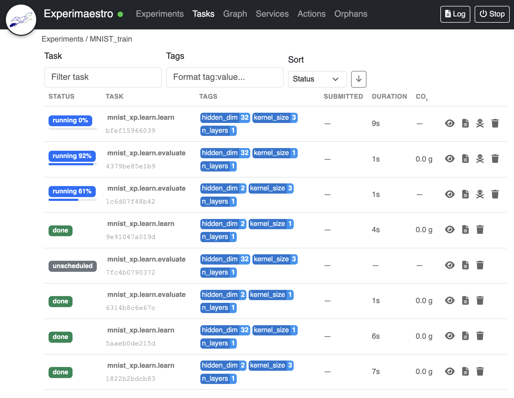

# Experimaestro

```{image} ./img/icon.svg
:alt: Experimaestro
:width: 120px
:align: left
```

[](https://github.com/experimaestro/experimaestro-python)

**Experimaestro** is a Python framework designed for researchers and engineers who need to manage complex, large-scale experimental workflows without losing track of reproducibility.

Unlike traditional schedulers, Experimaestro focuses on the **experimental logic**: how configurations relate to each other and how results are organized.




## Why Experimaestro?

Experimaestro solves common pain points in research workflows by providing:

- **🧩 Configuration-as-Code:** Define your experiments using strongly-typed Python objects. Forget about fragile JSON/YAML files; benefit from IDE autocompletion, type checking, and recursive parameter management.

- 🛡️ **Deduplication & Reproducibility**: Every task is assigned a unique identifier based on its parameters. If you try to run the same experiment twice, Experimaestro knows—ensuring you never waste compute time on results you already have.

- 📁 **Organized by Design** Results are automatically cached in a predictable directory structure derived from task identifiers. No more "results_v2_final_fixed.pt"—your file system stays as clean as your code.

- 🏗️ **Built-in Scalability** Seamlessly transition from local testing to high-performance clusters. Use **Connectors** (Local, SSH) and **Launchers** (Direct, Slurm) to run the same experimental code across different environments.

- 📺 **Real-time Monitoring** Track running and completed experiments as they progress, from a textual (terminal) UI or a web UI.

---

## Difference with Other Projects

Experimaestro differentiates itself from traditional job scheduling software
like [OAR](https://oar.imag.fr) and [Slurm](https://slurm.schedmd.com), which
focus more on resource allocation than on managing experimental workflows. It
also stands apart from other experiment management tools like
[Comet](https://www.comet.ml), [Sacred](https://github.com/IDSIA/sacred),
[FGLab](https://github.com/Kaixhin/FGLab), and
[Sumatra](http://neuralensemble.org/sumatra/). For instance, Comet emphasizes
collaboration and note-taking for machine learning experiments but is not
open-source and focuses on single-shot experiments. Sumatra and FGLab, based on
parameter files, offer less flexibility. Sacred, though open-source and allowing
for pre-processing steps, doesn't support the construction of complex
experimental plans like Experimaestro.

A closer relative is [exca](https://github.com/facebookresearch/exca)
("execute and cache seamlessly in python"), which—like Experimaestro—combines
configuration, caching, and cluster execution. exca decorates
[Pydantic](https://docs.pydantic.dev) model methods with `@infra.apply` to cache
their results and submit jobs through [submitit](https://github.com/facebookincubator/submitit).
Experimaestro goes further: it computes a unique identifier from the *full*
configuration for automatic deduplication and reuse across runs, composes tasks
into explicit dependency graphs and experimental plans, and abstracts execution
through pluggable launchers (Slurm, OAR) and connectors (local, SSH) with
built-in monitoring.

Experimaestro's distinct features include:

1. **Comprehensive Task Composition**: It allows for the composition of types
   and tasks within an experimental plan.
2. **Parameter Monitoring**: Offers a clear method to monitor experimental
   parameters using tags.
3. **Automated Output Organization**: Efficiently manages task outputs in the
   file system, simplifying result storage.
4. **Imperative Experiment Definition**: Unlike other tools that define
   experiments declaratively, Experimaestro adopts an imperative approach,
   enhancing flexibility in complex experimental planning.

## Guide to the Documentation

**🏁 Getting Started**
If you are new to the project, start with the [Tutorial](./tutorial.md). It walks you through setting up your first workspace and running a basic experiment: training a CNN on MNIST.

**🧪 Building Experiments**
Learn how to define your workflow:
  - [Configurations](./experiments/config.md): The heart of Experimaestro. Define parameters, nested structures, and value
    classes.
  - [Tasks](./experiments/task.md): Define the execution logic and manage dependencies.
  - Experimental [Plans](./experiments/plan.md): Compose tasks into complex matrices and track them using tags.

**⚙️ Execution & Infrastructure**
Control where and how your code runs:
  - [Launchers](./launchers/index.md): Manage execution environments (Direct, Slurm).
  - [Connectors](./connectors/index.md): Abstract file access and command execution (Local, SSH).

**🛠️ Advanced Tools**
  - [Jupyter Integration](./jupyter.md): Interact with your experiments from notebooks.
  - [API Reference](./api/index.md): Deep dive into the classes and methods.

# Detailed Outline

```{toctree}
---
maxdepth: 2
caption: "Experiments"
---
experiments/config
experiments/task
experiments/plan
experiments/workspace
experiments/actions
experiments/analysis
experiments
```

```{toctree}
---
maxdepth: 1
caption: "Execution"
---
launchers/index
connectors/index
```

```{toctree}
---
maxdepth: 1
caption: "Misc"
---
serialization
settings
services
interfaces
utilities
```

```{toctree}
---
maxdepth: 1
caption: "Integration"
---
jupyter
documenting
```

```{toctree}
---
maxdepth: 1
caption: "Reference"
---
api/index
cli
changelog
faq
```

```{toctree}
---
maxdepth: 1
caption: "Development"
---
development/experiment
development/api
```


:::{note}
Experimaestro and datamaestro are described in the following paper

Benjamin Piwowarski. 2020.
[Experimaestro and Datamaestro: Experiment and Dataset Managers (for IR).](https://doi.org/10.1145/3397271.3401410)
*In Proceedings of the 43rd International ACM SIGIR*
:::
